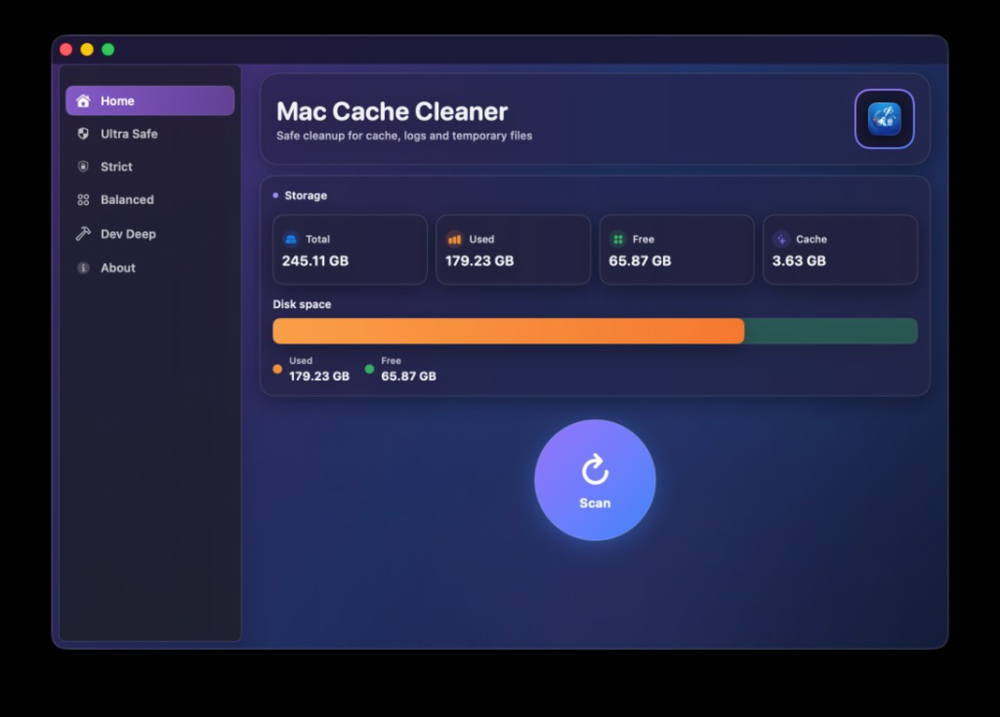

# Mac Cache Cleaner

macOS cache-cleaning utility built as a native SwiftUI desktop app.

## Screenshots

<p align="center">
  
</p>

## What it cleans

The app dynamically discovers safe cache-like folders under approved user-space roots and only shows paths that currently exist.
It supports:
- `Ultra Safe` mode: `~/Library/Caches` only.
- `Strict` mode: `Ultra Safe` plus dynamically discovered app container and group container cache folders, and conservative Xcode/Simulator cache roots.
- `Balanced` mode: `Strict` plus dynamically discovered log/temp folders in approved user-space roots.
- `Developer Deep Clean` mode: `Balanced` plus opt-in developer caches across multiple ecosystems (for example Gradle, npm/yarn/pnpm, pip/poetry, Android Studio, JetBrains, and extra Xcode build caches).

This means the app is useful for both:
- general Mac users who want safe cleanup (`Ultra Safe`, `Strict`, or `Balanced`)
- developers who also want deeper toolchain cleanup (`Developer Deep Clean`)

## Build and run the SwiftUI app

```bash
cd "/Users/abdulsamadkhan/Work/mac-cache-cleaner/SwiftUIMacCacheCleaner"
swift run
```

To build an app bundle:

```bash
cd "/Users/abdulsamadkhan/Work/mac-cache-cleaner/SwiftUIMacCacheCleaner"
./build_app.sh
open "dist/Mac Cache Cleaner SwiftUI.app"
```

## Usage

1. Click **Scan Sizes**.
2. Pick **Ultra Safe**, **Strict**, or **Balanced** discovery mode.
3. Review target inclusion reasons shown for each folder.
4. Keep recommended targets selected (or use **Select All**).
5. Click **Dry Run** to preview estimated reclaimable space and inaccessible folders.
6. Click **Clear Selected** and confirm.
7. Review the cleanup report in the footer (removed, skipped, inaccessible, estimated freed).
8. If a scan/cleanup takes too long, click **Cancel** to stop the active operation.

## Safety notes

- Only contents are removed; top-level target folders are retained.
- Files may be skipped if macOS denies permission.
- Discovery is allowlisted to known cache/log/temp roots (for example `~/Library/Caches`, app container cache/log roots, and developer caches like DerivedData).
- A second runtime safety check blocks cleanup of any path outside approved roots, applies mode-specific rules, and rejects symlink escapes that resolve outside the user home directory.
- Personal files and normal app data locations are intentionally not targeted.

## macOS permissions and Apple platform boundaries

- The app intentionally avoids SIP-protected system trees and does not clean arbitrary non-cache paths.
- Some folders may still be unreadable depending on local macOS privacy settings; inaccessible paths are reported and skipped.
- The app is designed for safe user-space cache cleanup, not full-disk indexing or broad file deletion.
